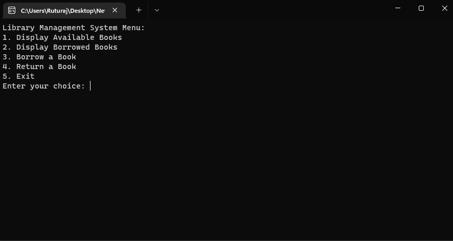
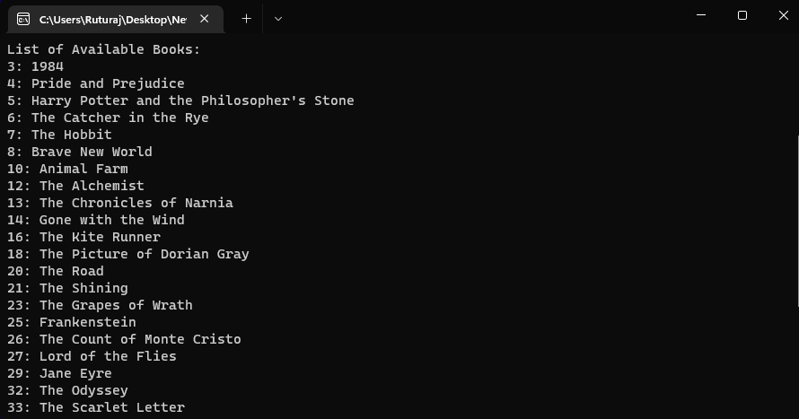
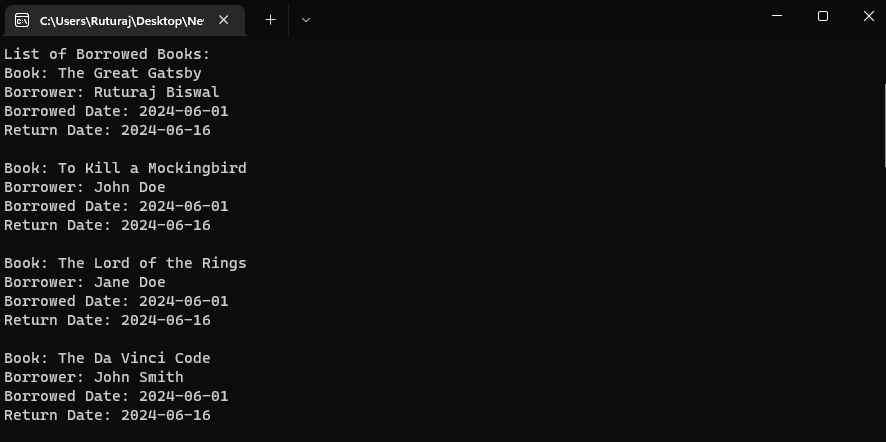

# Library Management System

This is a simple library management system implemented in C++. It allows users to manage a library collection, including displaying available and borrowed books, borrowing books, and returning books.

## Features

- Display available books
- Display borrowed books
- Borrow a book
- Return a book
- Exit the program

## Prerequisites

- C++ compiler (e.g., g++)
- [nlohmann/json](https://github.com/nlohmann/json) library for JSON handling

## Installation

### Step 1: Clone the repository

```
git clone https://github.com/ruturajbiswal/library-management-system.git
cd library-management-system
```

### Step 2: Download the JSON library

Download the `json.hpp` file from the [nlohmann/json GitHub repository](https://github.com/nlohmann/json/releases) and place it in the project directory.

### Step 3: Compile the code

Ensure you have a C++ compiler installed. You can use `g++` for this purpose.

```
g++ -o Main.exe Main.cpp -std=c++11
```

### Step 4: Run the executable

```
./Main.exe
```


## Usage

Upon running the program, you will be presented with a menu to perform various operations. Choose the desired option by entering the corresponding number and following the prompts.

## Screenshots

### Main Menu



### Available Books



### Borrowed Books




## Directory Structure

```
library-management-system/
├── Books.json           # JSON file storing book information
├── Main.cpp             # Main source code file
├── json.hpp             # JSON library header file
├── README.md            # This README file
└── Image/               # Directory containing screenshots
```

